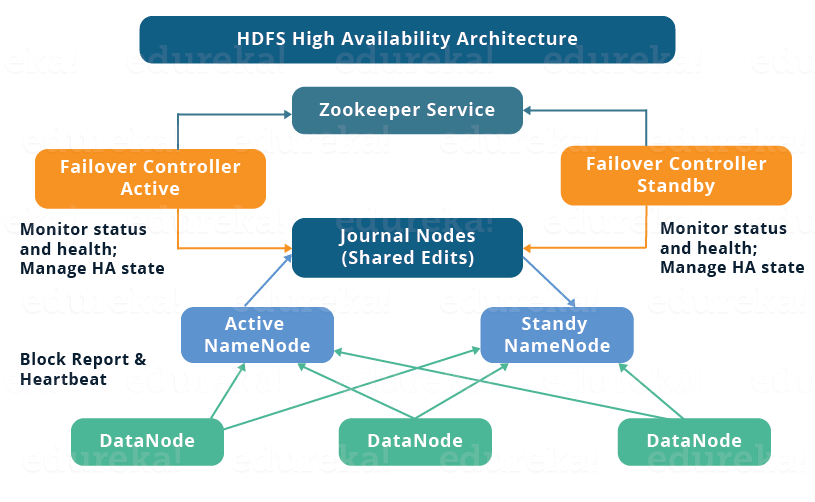
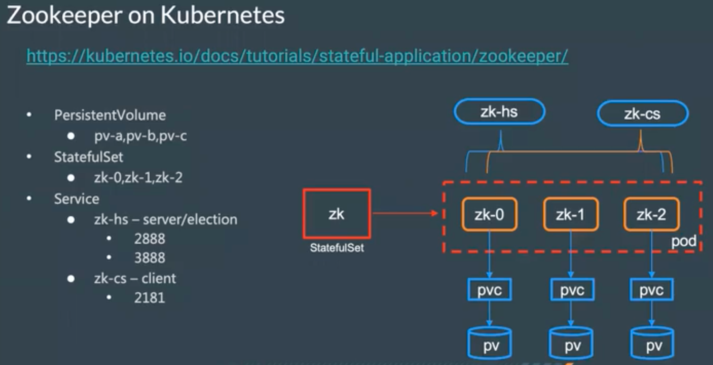
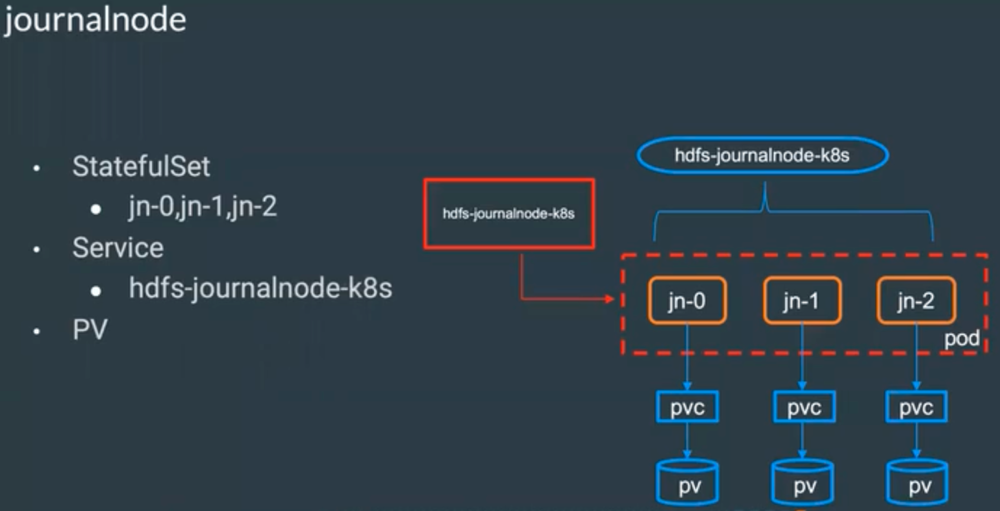
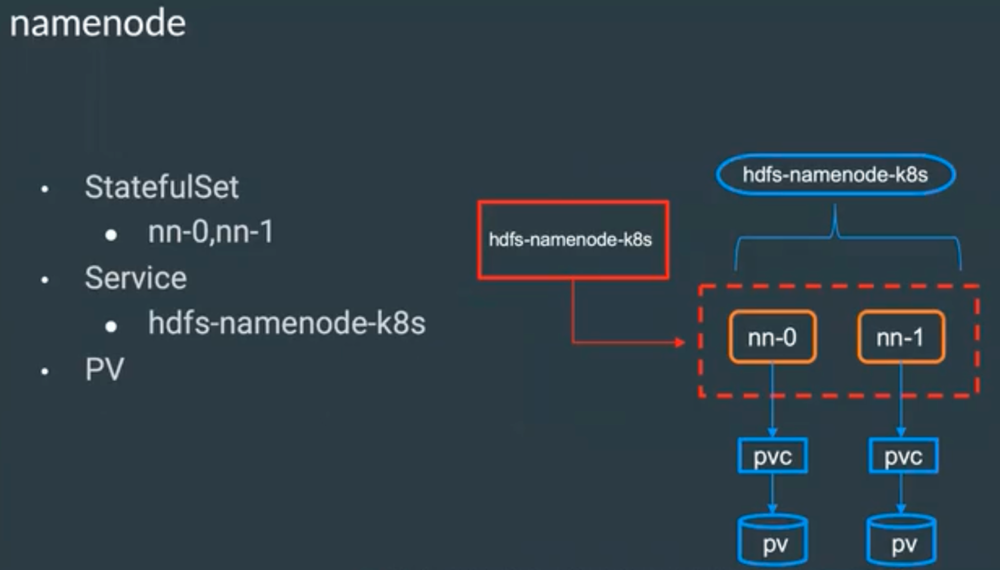
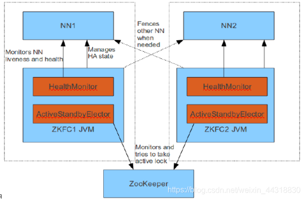
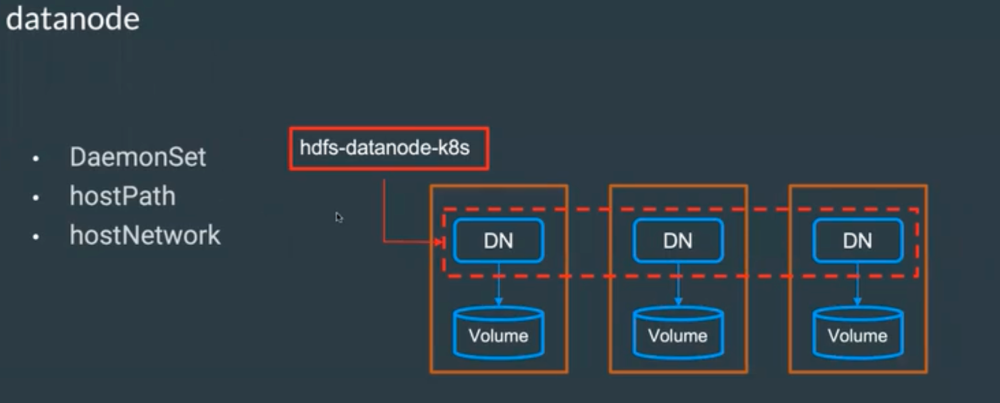

# Hadoop-HDFS on Kubernetes

## 1.方案选择
想要实现 HDFS 高可用 NN（NameNode）是关键，因为 NN 存放的是元数据信息，所以数据的存取都依赖了这些元数据信息。 

Hadoop1.X版本，NN是HDFS集群的单点故障点，每一个集群只有一个NN,如果这个机器或进程不可用，整个集群就无法使用。为了解决这个问题，出现了一堆针对HDFS HA的解决方案（如：Linux HA, VMware FT, shared NAS+NFS, BookKeeper, QJM/Quorum Journal Manager, BackupNode等）。

Hadoop有两种HA解决方案，这两种方案都是为了解决同一个问题：在主备节点间实现 editlog 共享：

1、[HDFSHighAvailabilityWithNFS](https://hadoop.apache.org/docs/stable/hadoop-project-dist/hadoop-hdfs/HDFSHighAvailabilityWithNFS.html)
这种个方案是将 editlog 放置在主用和备用 NN 都可以访问的 NFS 卷中，通过网络文件的特性实现可用。但是由于 NFS 的一些弊端（例如：网络性能和大量小文件读写效率等原因）目前该方案基本没人会使用。

2、[HDFSHighAvailabilityWithQJM](https://hadoop.apache.org/docs/stable/hadoop-project-dist/hadoop-hdfs/HDFSHighAvailabilityWithQJM.html) 这种目前主流的方案是采用 基于 QJM（Quorum Journal Service）这是一个基于Paxos算法实现的 HA。

## 2. HDFS HA 架构

组件说明：

1、Active/StandBy NN：高可用方案中NN有两个，一个是Active状态，表示正在对外提供服务的，活跃的NN。StandBy状态，不是对外提供服务的，随时准备替换ActiveNN.

2、ZKFC：监控 NN 所在节点的状态信息，同时维护与ZK的通信。HA方案中只有两个NN，每个NN都有一个ZKFC.

3、JournalNode：在HA架构里面SecondaryNameNode已经不存在了，为了保持standby NN时时的与Active NN的元数据保持一致，他们之间交互通过JournalNode进行操作同步。

## 3. Zookeeper HA

ZooKeeper 是一个分布式的、开放源代码的协调服务，他本身具备 Leader Election 机制，所以我们只需要运行指定 Quorum 服务器组就可以实现 Zookeeper 的高可用。
那么在 Kubernetes 中可以采用 StatefulSet 部署有状态的副本集并且采用 Headless-Service 实现副本间的网络发现即可完成 Zookeeper on Kubernetes HA 
。

## 4.JournalNode HA

为了保证Active/StandBy NameNode 的元数据一致性，HDFS 引入了 JournalNode 服务。 以下是 JournalNode 的主要职责：

事务日志 (Edit Logs) 的存储:

JournalNode 看可以看成一个高效的存储系统，能够实现数据的超快速写入与读取。JN是一个小集群（小的文件系统）。节点数需要是奇数台（1、3、5）

多数确认:

为了确保数据的持久性和可靠性，JournalNode 集群中的大多数节点必须确认写操作。
例如，如果你有 5 个 JournalNode，那么至少需要 3 个确认一个事务。
支持故障转移:

如果 Active NameNode 故障，Standby NameNode 需要成为新的 Active Node。为了这样做，它需要确保它拥有最新的文件系统状态。通过从 JournalNode 读取事务日志并应用它们，Standby Node 可以快速地获取最新状态，并在需要时进行故障转移。

## 5.NameNode HA
Hadoop2.x之后，Clouera提出了QJM/Qurom Journal Manager，这是一个基于Paxos算法（分布式一致性算法）实现的HDFS HA方案。

基本原理就是用 2N+1 台 JournalNode 存储 EditLog，每次写数据操作有 >=N+1 返回成功时即认为该次写成功，数据不会丢失了。当然这个算法所能容忍的是最多有N台机器挂掉，如果多于N台挂掉，那么集群将变得不可用。
> 注意：在HA架构里面SecondaryNameNode已经不存在了，为了保持standby NN时时的与Active NN的元数据保持一致，他们之间交互通过JournalNode进行操作同步

### 5.1 Failover Controller

HA模式下，会将 FailoverController 部署在每个 NameNode 的节点上，作为一个单独的进程用来监视 NN 的健康状态。FailoverController主要包括三个组件:

        HealthMonitor: 监控NameNode是否处于unavailable(不可用的)或unhealthy(不健康的)状态。当前通过RPC调用NN相应的方法完成。

        ActiveStandbyElector: 监控NN在ZK中的状态。

        ZKFailoverController: 订阅HealthMonitor 和ActiveStandbyElector 的事件，并管理NN的状态,另外zkfc还负责解决fencing（也就是脑裂问题）。

        上述三个组件都在跑在一个JVM中，这个JVM与NN的JVM在同一个机器上。但是两个独立的进程。一个典型的HA集群，有两个NN组成，每个NN都有自己的ZKFC进程。

## 6.DataNode
DataNode 是负责存储实际数据的节点。HDFS 采用 master/slave 架构，其中 NameNode（master）负责管理文件系统的元数据，而 DataNode（slave）负责管理和存储实际的文件数据。

在 Kubernetes 上部署 HDFS 的 DataNode 时，我们需要确保每个节点都运行一个 DataNode 实例，并能够访问本地存储和网络。为了满足这些要求，我们将使用以下 Kubernetes 功能：

1. DaemonSet:
   使用 DaemonSet 来部署 DataNode 可确保 Kubernetes 集群中的每个节点都运行 DataNode 的一个副本。当新的节点加入集群时，DaemonSet 将自动在新节点上启动一个 DataNode 实例。同样，如果节点从集群中被移除，相应的 DataNode 也会被终止。

2. hostNetwork:
   使用 hostNetwork: true 配置允许 DataNode 使用宿主机的网络命名空间。这确保 DataNode 可以直接使用宿主机的 IP 地址和端口，从而简化网络配置，并提高数据传输的性能。

3. hostPath:
   为了让 DataNode 访问宿主机的本地文件系统，并在本地存储 HDFS 数据块，我们将使用 hostPath 卷。hostPath 允许 DataNode 从其容器中访问宿主机的文件或目录。